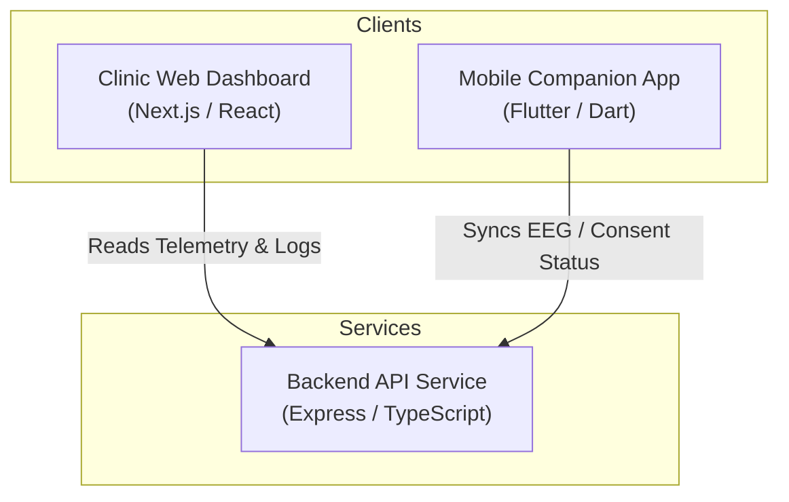

# MindWave — BCI Real-Time Patient Telemetry Platform

MindWave is an advanced medical telemetry platform that integrates Brain-Computer Interface (BCI) wearable headbands, a live clinical ward monitoring web dashboard, and an empathetic mobile companion application with a built-in AI guide.

---

## 📂 Repository Architecture

MindWave is organized as a yarn/npm monorepo containing the following components:



*   **`apps/clinic-dashboard/`**: Next.js client application for psychiatrists and clinical specialists to monitor patient outcomes, active alerts, and live ward telemetry feeds.
*   **`apps/mobile/`**: Flutter companion app for patients, supporting BLE headset pairing, real-time EEG sparklines, data-sharing consent controls, and Gemini-powered AI chat.
*   **`services/api/`**: Express Node.js backend API built in TypeScript, serving REST endpoints for BCI telemetry sync, user profiles, daily AI reports, and HIPAA consent status hooks.

---

## ✨ Key Features

1.  **Clinical Ward Live View**: Real-time telemetry monitoring displaying patient status lists, pulsing BCI connectivity dots, custom SVG circular severity gauges, and live EEG waveform sparklines.
2.  **Consent Manager**: Transparent data agreements control center. Patients can instantly revoke or grant data access from their mobile app, logged securely on the backend.
3.  **Gemini AI Guide Chat**: Empathetic AI companion assistant built inside the mobile app to assist patients during spikes in stress or anxiety.
4.  **Clinical Reports Feed**: Automated summaries, neural distress trigger identification, and clinician diagnostic notes compiled daily.

---

## ⚙️ Installation & Setup

### 📋 Prerequisites

Before setting up MindWave, ensure you have:
*   [Node.js](https://nodejs.org/) (v18 or higher)
*   [Flutter SDK](https://docs.flutter.dev/get-started/install) (v3.19 or higher)
*   Android SDK / Xcode configured for mobile compilation.

---

### 🚀 Getting Started

#### 1. Clone the Repository & Install Dependencies
Run the following at the root folder:
```bash
# Install root and workspace-wide dependencies
npm install
```

#### 2. Configure Environment Files
Create a `.env` file under `services/api/`:
```env
PORT=4000
```

Create a `.env` file under `apps/mobile/` (or configure Dart environment variables) for the Gemini API key:
```env
GEMINI_API_KEY=your_gemini_api_key_here
```

---

### 💻 Running the Applications

#### 🟢 Run the Backend API
The API handles real-time sync between client applications.
```bash
cd services/api
npm run dev
# The API will start on http://localhost:4000/api
```

#### 🖥️ Run the Clinician Web Dashboard
Starts the clinical supervisor workspace.
```bash
cd apps/clinic-dashboard
npm run dev
# The dashboard is hosted on http://localhost:3000
```

#### 📱 Run the Mobile Companion App
Launches the Flutter BCI controller application.
```bash
cd apps/mobile
flutter run
```

---

### 📦 Building for Production

#### Build Next.js Dashboard Bundle
```bash
cd apps/clinic-dashboard
npm run build
```

#### Build Flutter Android Release APK
```bash
cd apps/mobile
flutter build apk --release
# Outputs built APK to: build/app/outputs/flutter-apk/app-release.apk
```

---

## 🎨 Design System & Aesthetics

MindWave implements a custom calming design language optimized for high-stress medical and wellness environments:
*   **Clean Slate & Indigo Tokens**: Calm color palettes styled to reduce patient stress.
*   **Borderless Panels**: Removed heavy outlines, utilizing subtle backgrounds (`var(--bg-tertiary)`) for structural highlights.
*   **Static Hover Controls**: Disabled visual transformations, translation lifts, and floating shadow updates to follow standard, flat clinical layouts.
